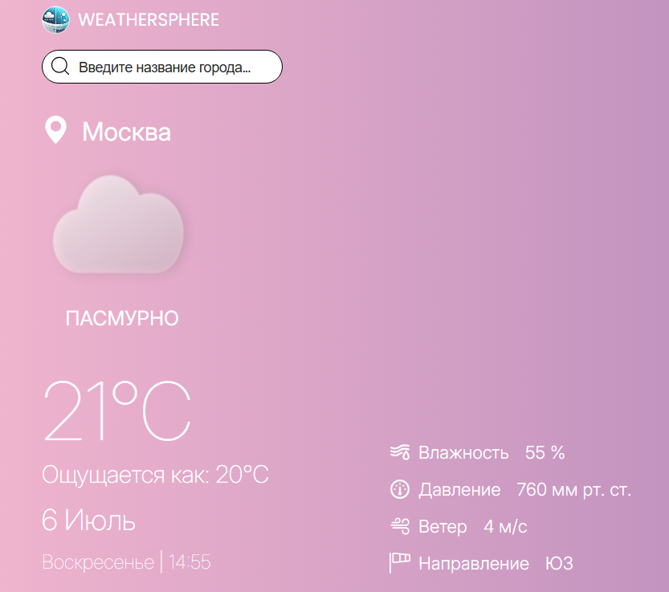

# WeatherSphere

React-приложение для просмотра прогноза погоды с использованием API OpenWeatherMap.\
Проект доступен по ссылке: [WeatherSphere](https://zirex03.github.io/WeatherSphere/)

## О проекте

Простое и удобное приложение для проверки текущей погоды и прогноза на несколько часов в любом городе мира.

### Основные функции

* Отображение текущей погоды (температура, влажность, скорость ветра)

* Прогноз на несколько часов

* Поиск по городам

* Адаптивный дизайн

### Технологии
* React 18

* TypeScript

* SASS

* OpenWeatherMap API

### Скриншоты

